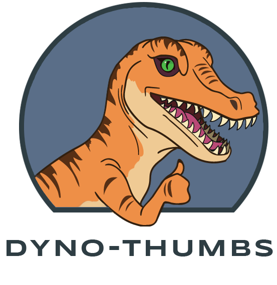

# dyno-thumbs
  
## An easy an quick way to make the perfect thumbnails  
Download the [github] repo and make awesome dynamic thumbnails offline!
1. save and unpack the zip file
2. open index.html in a web browser (preferably chrome)
3. thats it!

Collaboration is a wonderful thing!  
Fork the dev repo and help make it even better!

[github]: https://github.com/aguilaw/dyno-thumbs/
